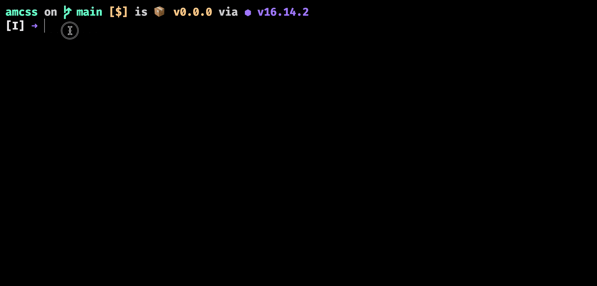
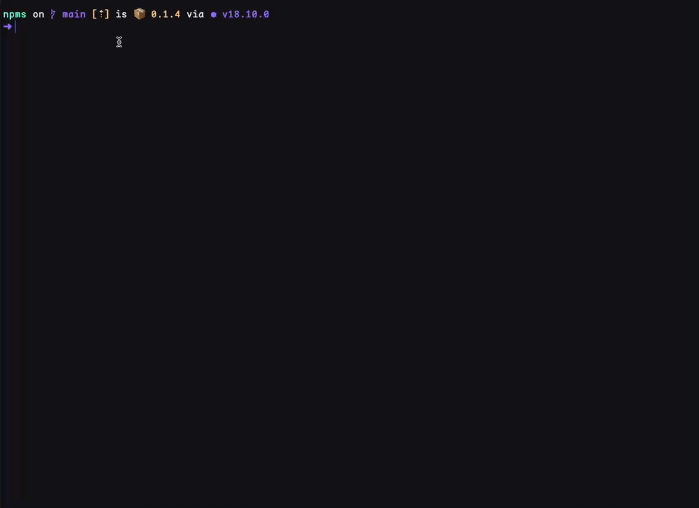

# NPMS(cripts)

a CLI shows and executes your project npm scripts

## Installation

```bash
pnpm install @alexzzz/npms
```

## Usage

```bash
# in your package root
npms
```

### List all scripts

then, you could see these things on your terminal：



We support recursively get `package.json` scripts.

You can press `<arrow-left>` and `<arrow-right>` to switch packages.

### Execute scripts (WIP)

- Press `<arrow-up>` and `<arrow-down>` to select a script.
- Press `<enter>` to execute the script.



Now you can only execute it, but actually, the behavior is a little weird.

So this feature is still under in development.

## Known Issues

- [ ] if packages too many, packages'tab will squeeze it together
- [ ] if scripts too many, scripts container could not scroll

These behaviors are caused by TEMir, and i maybe will make pr then.

## Next Step

- [ ] fix known issues
- [ ] support config
- [ ] show cli help command

## License

MIT, alexzhang1030

## Reference

- [temir](https://github.com/webfansplz/temir)
